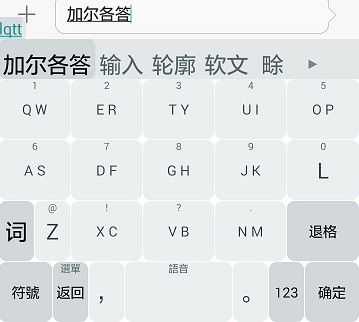

这是我认识同文和小狼毫以来，配置的第一个输入方案。感谢全程有 @xiaoqun2016 和 @osfans 老大的细致而耐心的指导。
记下整个过程，方便后来者学习。

## 一、准备篇

> 原文: <https://github.com/osfans/trime/wiki/五笔双键配置案例详解(一)-准备篇>

通过本案例，你可以学到：

- 小狼毫的一般配置和调试流程
- 小狼毫模糊音的使用
- 同文键盘的配置和对已有键盘布局的修改
- 键盘的切换

### 一般的调试流程

"工欲善其事，必先利其器"。搭建好下开发环境，使用良好的配置工具，做事可以事半功倍。

#### 文本编辑器

我使用的是 gVim，在 Windows 下。
Vim 编辑 yaml 文件有很多好处:

- Vim 自带了 yaml 文件的语法高亮，方便查看
- 小狼毫自带的 yaml 文件开头都配有 vim 的 modeline 行，会自动设置好缩进等相关选项，方便编辑
- Vim 本身也很强大，使用范围广，教程多，而且开源免费

#### 调试流程

1.  将你要反复修改或者反复打 patch 修改的 yaml 文件复制一份，放到你的工作目录(这样防止修改错了需要回厂)
2.  在工作目录创建 XX.custom.yaml 文件(如果已有就不要创建了) -- 建议不要在原文件上修改,而是通过打 patch 方法修改
3.  有两个批处理脚本如下,你可以直接复制过去使用

```shell
:: rime.bat
copy wubi86_double_key.schema.yaml %appdata%\rime
copy wubi86.dict.yaml %appdata%\rime

start WeaselDeployer.exe /deploy   ::重要的是这句，需要将小狼毫的安装目录添加到path环境变量中

rem 或者写成这样
rem "C:\Program Files\Rime\weasel-0.9.14\WeaselDeployer.exe" /deploy
pause
```

如果是在手机上调试同文输入法，则使用下面的:

```shell
:: trime.bat
adb push trime.yaml /sdcard/rime
adb push trime.custom.yaml /sdcard/rime
adb push wubi86_double_key.schema.yaml /sdcard/rime
adb shell am broadcast -a com.osfans.trime.deploy
pause
```

这样做的好处，就是每次修改，都相当于把系统文件恢复到你打 patch 之前的状态，你打 patch 造成的错误不会累积。

### 定制输入方案

我要实现的键盘效果如下所示:



实现效果类似九宫格，但是因为一个键上只有两个键同时又保留了电脑上的键盘布局。所以，保留了五笔的输入模式。

大致的步骤是（这也是本系列文章的标题）:

1.  先复制 wubi86 的输入法方案,实现自己的方案
2.  添加模糊音，实现双键方案
3.  对双键方案进行调整完善（码表共享和词频调整）
4.  在手机上定义双键键盘，实现中文输入
5.  定义键盘切换，实现英文输入
6.  对输入方案优化　（符号选 2-3 候选字等等）

1－3 都是在电脑的小狼毫进行调试，4－6 则是在手机的同文输入法上进行调试。

## 二、添加一个输入方案

> 原文: <https://github.com/osfans/trime/wiki/五笔双键配置案例详解(二)-添加一个输入方案>

把大象装到冰箱里分几步？  
答: 三步：

1.  把冰箱门打开
2.  把大象推进去
3.  把冰箱门关上

添加一个输入方案分几步？  
答: 也是三步:

1.  得到一份方案 (编写或者复制)
2.  为输入方案定义`schema_id`和`name`
3.  将输入方案`schema_id`添加到`default.yaml`的`shcema_list`中

OK, 现在按 `Ctrl+~` 就可以切换了。

### 得到输入方案

由于五笔双键是在`wubi86`的基础上的，所以，你必须有原始的`wubi86.schema.yaml`和`wubi86.dict.yaml`这两个文件。
`wubi86.schema.yaml`存放的是 wubi 的方案的一般处理流程，我们有了这个模板，就可以方便地进行修改。
`wubi86.dict.yaml`这个文件存放的是 wubi86 的码表，即所有的汉字、词组和对应的编码。我们会在这个码表的基础上进行模糊音处理，从而生成一个新的，适合双键的码表。

闲话少说，总之第一步就是原来的`wubi86.schema.yaml`复制一份，重命名为`wubi86_double_key.schema.yaml`

### 生成新的输入方案

第二步，就是在前一步基础上，将`wubi86_double_key.schema.yaml`文件中下面两项给替换掉:

```yaml
　schema_id: wubi86_double_key　#id是给系统看的，系统中引用都是通过它
  name: "五笔86双键版"　　　#name是给人看的，切换输入方案的时候，这个名字就会出现
```

说明：替换`schema_id`，是因为每个输入方案必须有一个独立的标识（后面会用到）。替换了`name`，是给人看的。

### 添加方案到系统列表

经过上面的两步，我们其实就已经有了一个名字独一无二的输入方案。虽然输入主案的内容与 wubi86 一模一样，但是至少我们先配置一下，然后就可以在系统方案中看到他。
在`default.custom.yaml`文件添加我们的方案 id。

```yaml
patch:
  schema_list:
    - schema: wubi86
    - schema: wubi86_double_key #我们的方案ID
```

**重新布署**

现在切换到小狼毫，然后按下小狼毫的热键，`` Ctrl+`  ``或者`F4`试试
现在是不是就可以看到我们的输入方案的名称了？
切换过去试一下，是不是跟系统自带的五笔一模一样？

### 提高篇

如果你有兴趣深究，还可以切换到`%AppData%/rime`路径下，看看重新布署后，到底生成了哪些文件。
其实生成的文件中以 wubi86 开头的文件，只有三个:

- wubi86.prism.bin #输入法的棱镜文件
- wubi86.reverse.bin 　 #输入法反查的文件
- wubi86.table.bin #输入法的码表文件

由于我的码表文件共用的是 wubi86 的文件，所以我们跟 wubi86 其实是共用的一套输入法棱镜文件。
看`wubi86_double_key.yaml`中的内容，就知道了。

```yaml
translator:
  dictionary: wubi86 #注意这里,其实引用的是wubi86.dict.yaml码表文件
  enable_charset_filter: true
  enable_encoder: true
```

### 小结

现在，你可以回顾一下前面学到的知识。

1.  每个输入方案，有两个名字: `schema_id`和`name`。一个是系统使用，一个是显示给人看。
2.  定义了输入方案和`schema_id`后，只要将`shcema_id`添加到`default.custom.yaml`文件的`schema_list`中。就可以切换到该输入方案了。

## 三、用模糊音实现双键转换

> 原文: <https://github.com/osfans/trime/wiki/五笔双键配置案例详解(三)-用模糊音实现双键转换>

前面的热身已经结束，下面开始真正的定制了。

这部分的定制还是在 PC 的小狼毫上进行，主要修改上一节中复制得来的，`wubi86_double_key.schema.yaml`文件。

### 具体的配置

将`wubi86_double_key.schema.yaml`文件中的`speller`节点修改如下：

```yaml
speller:
  delimiter: " ;'"
  max_code_length: 4
  algebra:
    - derive/w/q/
    - derive/r/e/
    - derive/y/t/
    - derive/i/u/
    - derive/p/o/

    - derive/s/a/
    - derive/f/d/
    - derive/h/g/
    - derive/k/j/

    - derive/c/x/
    - derive/b/v/
    - derive/m/n/
```

上面的代码就是用来改造五笔双键，也是双键输入法定制的核心。

### 原理说明

这里主要用到的技术就是模糊音。
注意上面的`derive`你可以理解为替换的意思，比如 `- derive/w/q`就是将码表编码中的所有 w 都替换为 q。

从我们要定制的输入法图片上，我们可以看出，五笔双键的键盘每个按键上有两个键。
但是，目前小狼毫的 librime 并不支持，输入时对按键进行模糊化，即输入一个按键可能有两种情况(也正是这个原因，同文输入法目前不能支持九宫格，期待@佛振老大等人可以快点更新呀)。

我们不能对输入编码进行模糊化，那就只能对码表进行模糊化。

想象一下，我们现在只能输入一半的按键，比 QW 键其实是 Q 键，只是外观写的是"Q/W"。这样用户就只能输入 Q，而不可能输入 W 了。
如果用一个简单的直接的办法实现，能将码表中所有的字都打出来，那就是事先将码表中的所有的 W 都替换成 Q。将 R 替换成 E 等等。这样就可以实现模糊化了。
因为，输入 Q 时候，原来为编码为 W 的字(编码已经被替换成 Q)也会出来。
这样要修改码表，虽然比较复杂，也不推荐，但是可以帮助我们理解一下概念。

拼写运算是 rime 对输入法编码进行定制的最强大的武器。
而正则表达式又是拼写运算的核心知识点。
关于这两者，大家有兴趣可以查看设计书中具体连链接。

### 使用和存在的问题

现在再运行脚本，部署一下。看看会发生什么？

`Ctrl+~`,切换到"五笔双键"。按一下 A,"工"和"要"都出来了，即 A 和 S 上的简码都出来了。

呵呵，是不是实现了？
别着急。目前还是很多问题的：

1.  现在切换到 wubi86，试着输入几个字，你会发现，wubi86 也被模糊化了。
2.  注意词频是有问题的，你试着输 lqtt. 显示 "输入"这个单词，居然在"加尔各答"后面？

以下都是@xiaoqun2016 老师给出的回答.具体见  
<https://github.com/osfans/trime/issues/61>

#### 共享码表的问题

在`translator`结点下，添加如下定义

```yaml
　prism: wubi86_double_key
```

替换 prism 这个属性，表示生成的码表棱镜文件。即最终会生成一个名为`wubi_double_key.prism.bin`的二进制文件，用来存储我们加了模糊音替换后的 wubi86 的码表。
如果不加这个选项，就会与原来的`wubi86.schema`共用一个码表，这样就会改变原来的输入方案。即使用标准的 wubi86 也会有模糊音的现象。

#### 模糊化后的词频问题

这里主要涉及码表翻译器(table_translator)和音节翻译器(script_translator)
`table_traslator`对拼写运算支持得不好，经典模糊音转换来的字词的频率都默认为 0，所以无法按正常的词频显示。
`script_translato`r 不存在这个问题，但是可能会有别的问题。这个我也在理解中

### 修改后的源码

以下为我现在使用的 `wubi86_double_key.schema.yaml`的源码

```yaml
# Rime schema settings
# vim: set sw=2 sts=2 et:
# encoding: utf-8

schema:
  schema_id: wubi86_double_key
  name: '五笔86双键版'
  version: '0.12'
  author:
    - 發明人 王永民先生
  description: |
    五筆字型86版
    碼表源自 ibus-table
    請安裝【袖珍簡化字拼音】以啓用 z 鍵拼音反查

switches:
  - name: ascii_mode
    reset: 0
    states: [中文, 西文]
  - name: full_shape
    states: [半角, 全角]
  - name: extended_charset
    states: [通用, 增廣]

engine:
  processors:
    - ascii_composer
    - recognizer
    - key_binder
    - speller
    - punctuator
    - selector
    - navigator
    - express_editor
  segmentors:
    - ascii_segmentor
    - matcher
    - abc_segmentor
    - punct_segmentor
    - fallback_segmentor
  translators:
    - punct_translator
    - reverse_lookup_translator
    #    - table_translator
    - script_translator

speller:
  delimiter: " ;'"
  max_code_length: 4
  algebra:
    - derive/w/q/
    - derive/r/e/
    - derive/y/t/
    - derive/i/u/
    - derive/p/o/

    - derive/s/a/
    - derive/f/d/
    - derive/h/g/
    - derive/k/j/

    - derive/c/x/
    - derive/b/v/
    - derive/m/n/

translator:
  dictionary: wubi86_double_key
  enable_charset_filter: true
  enable_encoder: true

reverse_lookup:
  dictionary: pinyin_simp
  prefix: 'z'
  tips: 〔拼音〕
  preedit_format:
    - xform/([nljqxy])v/$1ü/
    - xform/([nl])ue/$1üe/
    - xform/([jqxy])v/$1u/

punctuator:
  import_preset: default

key_binder:
  import_preset: default

recognizer:
  import_preset: default
  patterns:
    reverse_lookup: '^z[a-z]*$'
```

## 四、实现手机上的双键键盘

> 原文: <https://github.com/osfans/trime/wiki/五笔双键配置案例详解(四)-实现手机上的双键键盘>

现在我们已经有了一个可以实现双键的输入方案。虽然是在电脑上测试的，但是在手机上也是可以使用的。
我们还缺少一个对应的手机键盘。下面的工作需要在手机上布署测试了。

### 具体的配置

按惯例，还是先贴上相关代码，再慢慢分析。
我们通过对`trime.yaml`打 patch 来实现

```yaml
#trime.custom.yaml
patch:
  #1、新建一個按鍵佈局wubi86_double_key
  'preset_keyboards/wubi86_double_key': #佈局ID
    author: 'boboIqiqi' #作者
    name: '五笔双键' #方便自己辨識的名字
    ascii_mode: 0 #默認進入中文狀態
    height: 60 #每行高度
    width: 20 #按鍵默認寬度（取所有按鍵中用得較多的寬度值，接下來就可以少寫一些width了）
    keys: #按鍵排列
      #第一行
      - { label: 'Q W', click: q, long_click: 1 }
      - { label: 'E R', click: e, long_click: 2 }
      - { label: 'T Y', click: t, long_click: 3 }
      - { label: 'U I', click: u, long_click: 4 }
      - { label: 'O P', click: o, long_click: 5 }

      #第二行
      - { label: 'A S', click: a, long_click: 6 }
      - { label: 'D F', click: d, long_click: 7 }
      - { label: 'G H', click: g, long_click: 8 }
      - { label: 'J K', click: j, long_click: 9 }
      - { label: 'L', click: l, long_click: 0 }

      #第三行
      - { label: '词', click: Shift_L, width: 10 }
      - { label: 'Z', click: z, long_click: '@', width: 10 }
      - { label: 'X C', click: x, long_click: '!' }
      - { label: 'V B', click: v, long_click: '?' }
      - { label: 'N M', click: n, long_click: '.' }
      - { click: BackSpace }

      #第四行
      - { click: Keyboard_symbols, width: 15 }
      - { click: Keyboard_qwerty, label: '全', long_click: Menu, width: 10 }
      - { click: '，', width: 10 }
      - { label: ' ', click: space, long_click: VOICE_ASSIST, width: 30 }
      - { click: '。', width: 10 }
      - { label: '123', click: Keyboard_number, width: 10 }
      - { label: '确定', click: Return, width: 15 }

  'style/keyboards':
    - .default
    - default
    - number
    - symbols
    - qwerty

  'preset_keyboards/qwerty/ascii_mode': 1

  'style/candidate_view_height': 36
  'style/round_corner': 0.0
  'style/label_text_size': 18
  'style/comment_height': 14
  'preset_keys/Keyboard_defaultw': #返回中文键盘
    label: 英
    select: .default
    send: Eisu_toggle
  'preset_keys/space':
    functional: false
    label: ' '
    repeatable: false #关掉空格键重复
    send: space
```

### 使用说明

1.  将上面的源码存储为`trime.custom.yaml`
2.  将`trime.custom.yaml`以及`wubi86_double_key.schema.yaml`都拷贝到手机的`/sdcard/rime`目录下
3.  到同文的主设置界面，点击重新布署

注：也可以使用准备篇中介绍的批处理脚本，记得回去复习一下哦。

现在，在选单中切换到"五笔双键"输入方案，就可以使用它了。

### 原理说明

主要使用到的技术如下:

- 定义一个键盘
- 声明和切换键盘
- 通过打 patch 修改键盘布局的属性

建议阅读 @xiaoqun2016 老师和 @osfans 老大 写的 [trime.yaml 详解](./trime.yaml.md)
